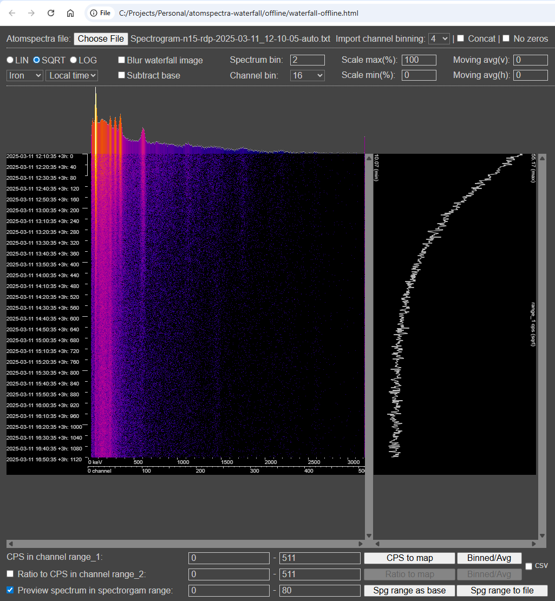
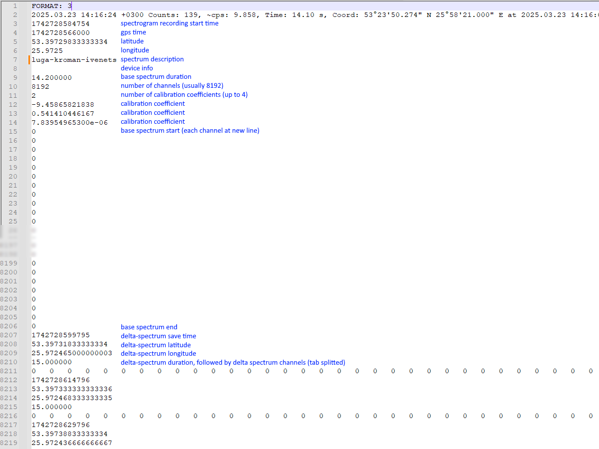

# atomspectra-waterfall

Simplest waterfall image creator for AtomSpectra spectrogram file (starting from atom spectra 6.6.15).

Provided AS IS, use at your own risk. This software is not certified as a measurement tool, any results obtained with this software cannot be used for official statements, conclusions or decisions.



# Usage (basic, browser only):
1. copy spectrogram file from smartphone to computer
2. download this repository
3. open ```offline/waterfall-offline.html``` file in browser, (Chrome is recommended)
4. use file upload control to load spectrogram file 
5. apply spectrum/channel binning, averaging etc.
6. use right mouse click on spectrogram image - save image as to save current image
7. to convert your atom spectra spectrogram to radiacode format use ```offline/rcspg-ofline.html```

# Advanced Usage (command line, suitable for large spectrograms):
1. copy spectrogram file from smartphone to computer
2. install nodejs - https://nodejs.org/
3. download this repository
4. open folder containing waterfall-cli.js in console/terminal
5. run ```node waterfall-cli.js <spectrogram file>```, for example ```node waterfall-cli.js "sample-data/nano-3/Spectrum-2024-09-29_20-48-55-Spectrum_auto.txt"```
6. open generated ```Spectrum-2024-09-29_20-48-55-Spectrum_auto.html``` in web browser
7. right mouse click on spectrogram - save image as

CLI Parameters:
1. ```-channel-binning X``` reduce channel count (spectrogram width) by provided factor (X), i.e. ```-channel-binning 8``` makes 1024 channels from 8192, default is 4
2. ```-spectrum-binning X``` reduce spectrum count (spectrogram height) by provided factor (X), i.e. ```-spectrum-binning 2``` makes 100 spectrums from 200, default is 1
3. ```--rcspg``` outputs data in radiacode spectrogram format

Combining spectrogram rows into single spectrum (if you want to examine some part of spectrogram in [BecqMoni](https://github.com/Am6er/BecqMoni), for instance):

run ```node combine-cli.js <spectrogram file> -from-index X -to-index Y```, for example ```node combine-cli.js "sample-data/nano-3/Spectrum-2024-09-29_20-48-55-Spectrum_auto.txt" -from-index 270 -to-index 330```

```<spectrogram file name>_combined.txt``` is created

# Limitations
1. browser version could open spectrogram files up to 500 Mb in Chrome
2. spectrogram is rendered as a single image, large image like 8k channels * 20k spectrums might not be rendered, apply channel and spectrum binning to reduce image size
3. spectrogram data is stored in browser memory, working with large spectrograms might easily hit the 4 Gb limit, if you do not have strong reason to view spectrum as 8k channels, apply channel binning during import (4x by default)

# How to create spectrogram file?
1. update [AtomSpectra](https://github.com/Am6er/AtomSpectra) application to version 6.6.15.112 or higher (latest is usually recommended), you could download it from [software_kbradar](https://t.me/software_kbradar) Telegram channel
2. go to `Settings`, set `Save delta every XX s` under `Spectrogram` section to desired interval, each new spectrogram row (delta spectrum) will be added to spectrogram file with this interval
3. if you want to record coordinates for each spectrogram row, ensure `Add GPS coordinates to files` checkbox is enabled in `Settings` under `Files` section
4. go to `Spectrum -> Set description` menu, enter description
5. start spectrum recording, soon you will see message `Spectrogram recording is started`, do NOT stop spectrum recording until spectrogram is done, `stop -> start` will create a new spectrogram file
6. if spectrogram is started from already collected spectrum (or loaded from file), it is stored as `base spectrum` in the beginning of spectrogram file
7. stop spectrum recording when needed, go to application folder and search for `Spectrogram-<spectrum description>-<date>.txt`

Tip: if you want to check what is recorded to spectrogram at the moment:
Spectrogram preview mode:
1. go to `Spectrogram -> View` menu option
2. inspect spectrogram
3. close spectrogram view to go back to main window to inspect spectrum collected since recording start

Alternative way (spectrum change mode):
1. go to `Settings`, set `Diff time: XX s` under `Spectrum Change` section to similar interval (or whatever you need), this setting is independent and does not affect `Save delta every XX s`
2. while recording is in progress, go to `Spectrum -> Spectrum Change` menu option, enable this option
3. application starts collecting and displaying delta spectrum in memory for XX seconds (set in #1), once XX seconds elapsed, it will show spectrum for the latest XX seconds (sliding window)
4. disable `Spectrum -> Spectrum change` menu option to view spectrum collected since recording start

# Available controls
## Upload
1. set initial channel binning: AtomSpectra writes to spectrogram all 8k channels which requires time and memory to process, if you do not have clear reasons to view spectrum as 8k channels, use binning during import to reduce cpu/memory usage and improve rendering performance
2. click upload button to open spectrogram file you want to render
3. observe spectrogram and cps plot

You could also select multiple files at once to combine several spectrograms into one (ordered by time ascending). Calibration will be taken from the first spectrogram. Spectrogram bounds are marked on time axis as red horizontal line.

## Save spectrogram or cps plot
1. use right mouse click on either spectrogram or cps plot image -> `Save image as...`
2. cps plot is saved in horizontal orientation, despite rendered vertically to be in sync with spectrogram

## Scale/Palette control
1. Lin/Sqrt/Log - applies linear/non-linear scale on top of color palette and cps plot view, `Sqrt` is default
2. Palette selector - changes color palette, you could also use double click on spectrogram image, `Iron` is default
3. Scale max(%) - defines maximum value for a chosen color palette, i.e setting to 50% will use max palette color for any cps higher than 50% of max cps over whole spectrogram (values above 100 are allowed via manual typing)
4. Scale min(%) - same as max, but for minimum value (calculated relative to max cps over whole spectrogram)
5. Blur waterfall image - applies blur effects, sometimes makes spectrogram more smooth

## Time axis
1. time axis displays two values: time and spectrum index. Spectrum index is always original index in source file (even with spectrum binning)
2. timezone dropdown - selects which timezone should be used on timestamps (AtomSpectra writes timestamps in the UTC), default is Local (browser local, not local time where spectrogram was recorded)
3. any time gaps detected are marked as horizontal red lines (for example, previous delta duration is 10 seconds, but next delta saved after 15 seconds - indicates potential data loss)

## Binning
1. Spectrum bin - reduce spectrogram height by combining spectrogram rows, default is 1
2. Channel bin - reduce spectrogram width by combining channels, default is 16 (512 channels)

## Averaging
1. Moving avg(v) - moving average applied to spectrogram rows (vertically on spectrogram), defines number of neighbors used, ex. 5 means that each point will be an average of 2 neighbors back, 3 ahead and current row itself
2. Moving avg(h) - moving average applied to channels (horizontally on spectrogram), defines number of neighbors used, ex. 4 means that each point will be an average of 2 neighbors back, 2 ahead and current channel itself

## Base spectrum
1. Subtract base - subtracts base spectrum stored in spectrogram from each spectrogram row, affects both spectrogram and cps plot

## Cps plot channel range
Cps plot displays count rate for a specific range of channels.
1. "Cps in channel range_1" - defines main range as [from channel index, to channel index]
`hold 'c' key + two left mouse clicks` - set channels under cursor as range_1
2. "Ratio to cps in channel range_2" - enables comparison mode, renders 3 plots:
  a. count rate in range_1
  b. count rate in range_2
  c. ratio of count rate in range_1 to count rate in range_2 (range_1/range_2)
`hold 'a' key + two left mouse clicks` - set channels under cursor as range_2
3. "Export cps" - click to generate file with cps data. This button exports original(unchanged) spectrogram data, use "Binned/Avg" to export data with additional binning/averaging.
4. "Export cps ratio" - click to generate file with cps ratio data. This button exports original spectrogram data, use "Binned/Avg" to export data with additional binning/averaging.

*Use "csv" and "rctrk" radio buttons to select export type.
If spectrogram contains GPS data, .rctrk map could be imported to AtomSwift (Atom Dosimeter) application.

## Spectrum preview and export
Preview shows spectrum combined from selected spectrogram range as [from row index, to row index], index is always original, zero-based, despite binning applied
1. Preview spectrum in spectrogram range - enables spectrum preview
`hold 's' key + two left mouse clicks` - set row indexes under cursor as spectrum range
2. Spg range as base - overrides base spectrum, sets it from selected spectrogram range
3. Spg range to file - exports spectrum combined from selected spectrogram range (with channel binning applied during spectrogram import, not the current binning)

# Spectrogram file format

